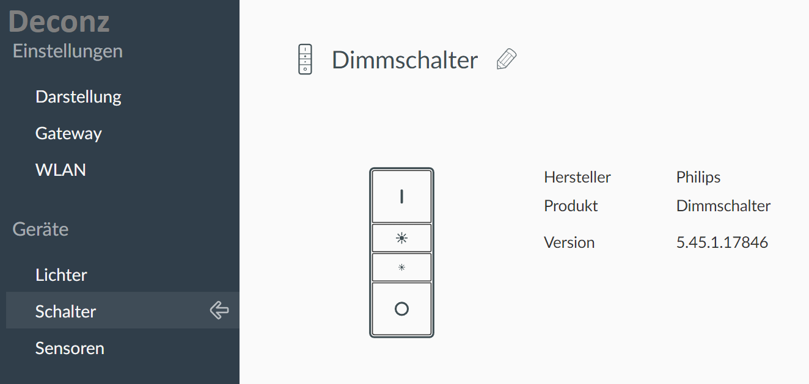
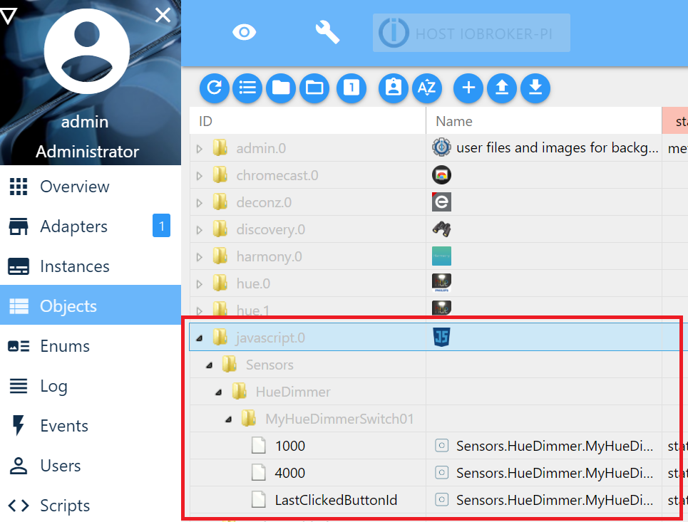

# IO-Broker - Controll your Hue Dimmer Switches with Conbee Deconz

This script is for home automation. It allows to register button events of the Philips Hue Dimmer Switch with IO-Boker. Also double- and long presses are supported. 

In my configuration, the Hue Dimmers are connected directly to my RasberryPi through the Conbee2 USB Stick manufactured by Dresden Elektronik and its Deconz software. 
This video explains nicely, how to set up the connection between Conbee and the IO-Broker:
 https://www.youtube.com/watch?v=SlP3IexwhOc

Once the devices are connected you go to the IO-Broker‘s  Skript section and create a new JavaScript Script. Then paste the file index.js of this repository into your editor. Make sure to also reconfigure the object paths to match your setup. Save and run the script.

